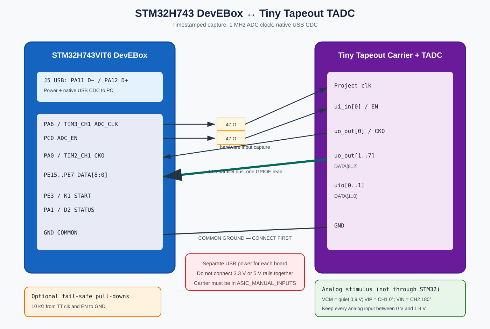

# STM32H743 DevEBox ↔ Tiny Tapeout Connection Schematic

This is the recommended bench interconnect for the STM32 firmware in this
repository. It is a connection schematic rather than a Tiny Tapeout carrier
PCB redesign.

## Digital connections

| Source | Recommended network | Destination |
|---|---|---|
| STM32 PA6 / TIM3_CH1 | 47 Ω series resistor | Tiny Tapeout project `clk` |
| STM32 PC0 | 47 Ω series resistor | Tiny Tapeout `ui_in[0]` / ADC `EN` |
| Tiny Tapeout `uo_out[0]` / CKO | Direct | STM32 PA0 / TIM2_CH1 |
| Tiny Tapeout `uo_out[1]` / DATA[8] | Direct | STM32 PE15 |
| Tiny Tapeout `uo_out[2]` / DATA[7] | Direct | STM32 PE14 |
| Tiny Tapeout `uo_out[3]` / DATA[6] | Direct | STM32 PE13 |
| Tiny Tapeout `uo_out[4]` / DATA[5] | Direct | STM32 PE12 |
| Tiny Tapeout `uo_out[5]` / DATA[4] | Direct | STM32 PE11 |
| Tiny Tapeout `uo_out[6]` / DATA[3] | Direct | STM32 PE10 |
| Tiny Tapeout `uo_out[7]` / DATA[2] | Direct | STM32 PE9 |
| Tiny Tapeout `uio[0]` / DATA[1] | Direct | STM32 PE8 |
| Tiny Tapeout `uio[1]` / DATA[0] | Direct | STM32 PE7 |
| STM32 GND | Direct, connect first | Tiny Tapeout GND |

The 47 Ω resistors reduce edge ringing and accidental contention current. Put
them close to the STM32 output pins. Values from approximately 33–68 Ω are
reasonable for short jumper wiring.

Optional 10 kΩ pull-down resistors on the Tiny Tapeout side of `EN` and `clk`
keep the ADC disabled and clock low while the STM32 is resetting or unpowered.

## Power rules

- Power the STM32 DevEBox from its J5 USB connector.
- Power the Tiny Tapeout carrier from its own intended USB connector.
- Connect the two grounds.
- Do **not** connect their 3.3 V or 5 V power pins together.
- The DevEBox board has no isolation between USB 5 V and its 5 V header, so do
  not apply a second external 5 V source while J5 USB is connected.

## Analog stimulus

The analog generator does not connect through the STM32:

| Source | Tiny Tapeout ADC pin |
|---|---|
| Quiet 0.9 V reference | `VCM`, analog pin D |
| Function generator CH1, 0° | `VIP`, analog pin F |
| Function generator CH2, 180° | `VIN`, analog pin G |
| Generator/reference return | Common ground |

Start with both sine channels at 0.4 Vpp and 0.9 V DC offset. Verify at the
ADC pins that `VIP`, `VIN`, and `VCM` remain between 0 and 1.8 V. Do not route
the function-generator signal into an STM32 GPIO.

## Safe connection order

1. Turn off generator outputs and disconnect USB power.
2. Connect all grounds.
3. Power and configure the Tiny Tapeout carrier for `tt_um_tadc_its` and
   `ASIC_MANUAL_INPUTS`.
4. Connect the STM32 input signals: CKO and DATA[8:0].
5. Connect STM32 outputs through the series resistors: `clk` and `EN`.
6. Connect the analog stimulus with generator outputs still off.
7. Power the STM32 through J5 USB, then verify `EN` and `clk` are low while
   idle.
8. Enable the analog source and confirm its voltage limits before pressing K1.

Never leave the carrier RP2040/RP2350 driving `clk` or `ui_in[0]` while the
STM32 is driving those same nets.
